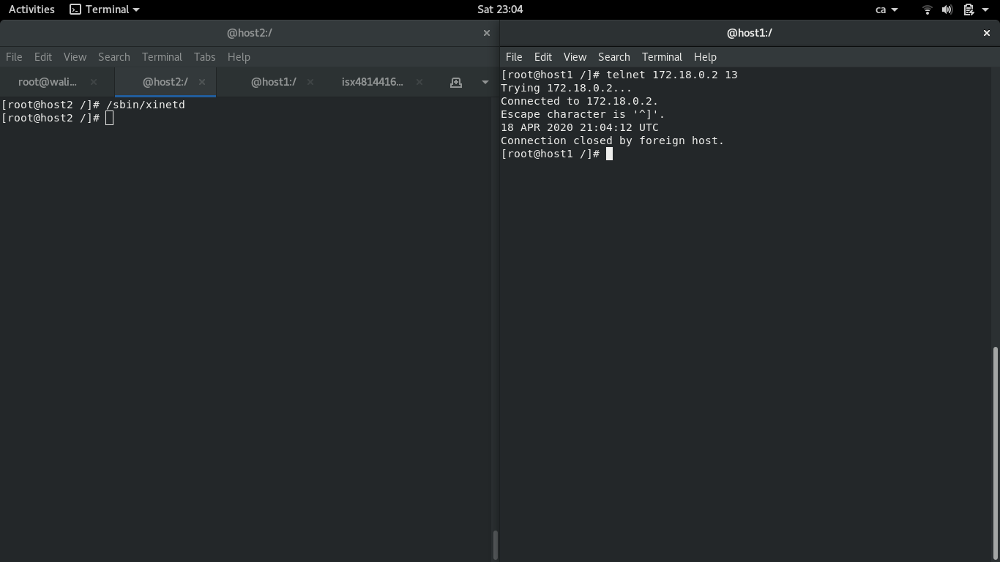
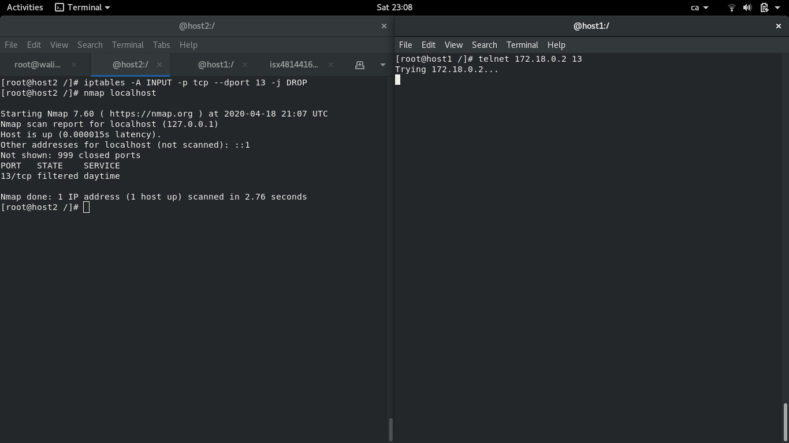

# IPTABLES
## default.sh
- Accions bàsiques de configuració d'un script de iptables:
1. Esborar les regles (flush) i comptadors actuals
2. Regles per defecte
3. Obrir la connectivitat pròpia al loopback i a la propia adreça ip
4. <Definir si el host fa de router

## input.sh
- En aquest script, juguem entre dos containers (a l'hora de fer del docker run, s'ha d'afegir **--cap-add=NET_ADMIN** per a que funcioni l'ordre **iptables**):
1. En el primer cas, a un docker obrim el port 13 (daytime-stream) i el tanquem:
- Port obert:  

- Port tancat:
